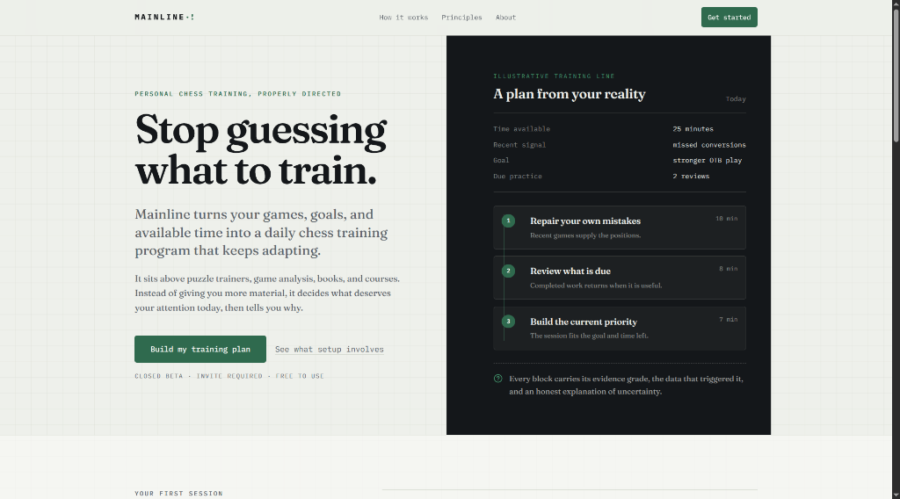
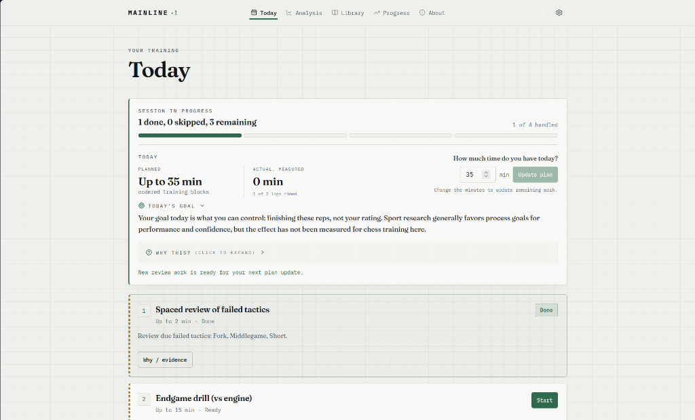
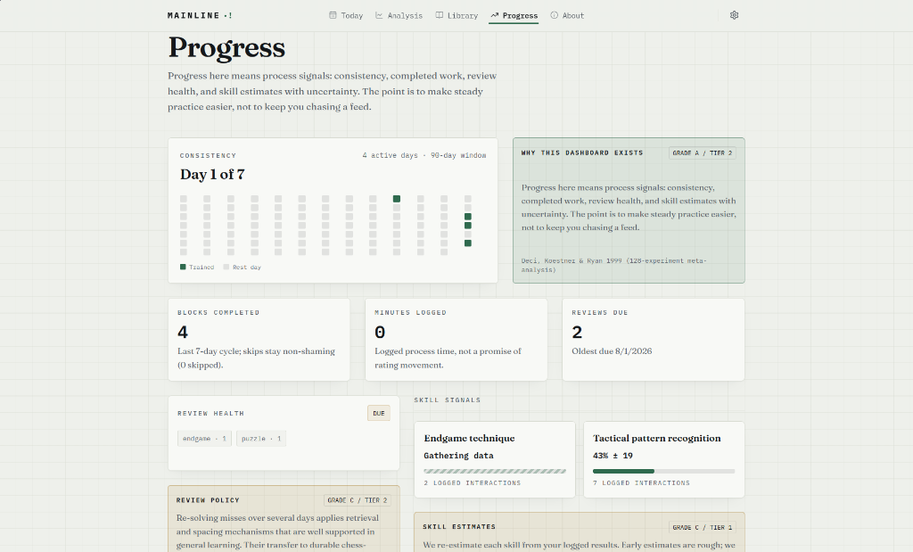

# Mainline

<p align="center">
  
</p>

<h3 align="center">Personalized, science-based chess training</h3>

<p align="center">
  Mainline turns your games, schedule, and goals into a daily chess training session that adapts as you play.
</p>

<p align="center">
  <a href="https://mainline-ten.vercel.app"><strong>Try the live beta &raquo;</strong></a>
</p>

<p align="center">
  <a href="https://github.com/kleinebossie/Mainline/actions"></a>
  <a href="https://github.com/kleinebossie/Mainline/blob/main/LICENSE"></a>
  
  
</p>

---

## App overview

Most chess apps give you infinite puzzles or static video courses. They leave the hardest question to you: what should I train today?

Mainline answers that question. It connects to your Lichess and Chess.com accounts, finds your recurring mistakes, and generates a focused training session for your available time.

### 1. Landing page



### 2. Daily training session (Today)



### 3. Process signals (Progress)



---

## Core capabilities

- **Adaptive daily sessions.** The engine builds your daily training plan around your target days and time budget. When you complete drills or play new games, the plan updates.
- **In-browser engine drills.** Solve puzzles, drill your past blunders, review games, and practice endgames against Stockfish 17 WASM running locally in your browser.
- **FSRS spaced repetition.** The scheduling engine uses the Free Spaced Repetition Scheduler (FSRS) algorithm to time review drills before you forget them.
- **Platform sync.** Import games automatically from Lichess and Chess.com or upload custom PGN files.
- **External study logs.** Track study time for physical books and external courses without paywalled lock-in.

---

## What Mainline is not

Mainline has clear boundaries:

- **No runtime LLMs or chatbots.** Mainline uses deterministic math, research-backed rules, and client-side Stockfish.
- **No manipulative streaks or dark patterns.** No streak freezes, no shame notifications, and no casino animations.
- **No paywalls.** All training features and science configurations remain completely free.
- **No hosted pirated books.** Mainline references external books and tracks your time, but it does not host copyrighted files.
- **No live gameplay server.** Play your rated games on Lichess and Chess.com. Mainline focuses on training.

---

## Science and evidence grades

Every recommendation in Mainline cites peer-reviewed research on skill acquisition and memory retention. Every drill shows an evidence grade:

| Grade       | Confidence level                                         | Example                                        |
| :---------- | :------------------------------------------------------- | :--------------------------------------------- |
| **Grade A** | Strong transfer in peer-reviewed chess or skill studies. | Spaced retrieval practice and blunder repair   |
| **Grade B** | Moderate confidence from general cognitive science.      | Explicit process goals and pre-move checklists |
| **Grade C** | Theoretical support with limited direct transfer data.   | Tactical motif taxonomy drills                 |
| **Grade D** | Exploratory practice with weak or anecdotal evidence.    | Passive master game replay                     |

### The central scientific truth

No scientific study has proven that any specific chess training method guarantees a rating increase.

Mainline uses the strongest available research to design your sessions. It gives you the evidence and rationale for every drill, but it will never promise rating gains.

---

## Architecture: engine vs methodology

The codebase separates application mechanics from chess learning science:

- **The Engine** (`src/engine/`, `src/analysis/`, `src/server/`, `src/db/`): Science-free, deterministic TypeScript code. Handles database storage, authentication, Stockfish coordination, and user interface.
- **The Methodology** (`src/methodology/`): Pure reader functions and versioned JSON files. Holds all learning science parameters, evidence grades, citations, and rationale text.

### The three architectural laws (CI enforced)

Automated tests enforce three architectural boundaries:

1. **L1 (Science in config):** The engine contains zero chess or learning constants. The engine imports methodology exclusively through `@/methodology`.
2. **L2 (Pure and deterministic):** Generators, adaptation algorithms, and methodology readers are pure functions. Code must receive time through a `Clock` interface and randomness through an explicit seed.
3. **L3 (Graded evidence):** Every methodology value returns a `GradedValue<T>` with a letter grade, evidence tier, and citation.

For complete specifications, read [VISION.md](file:///home/joebos/programming/Mainline/planning/VISION.md), [BUILD.md](file:///home/joebos/programming/Mainline/planning/BUILD.md), and [METHODOLOGY.md](file:///home/joebos/programming/Mainline/planning/METHODOLOGY.md).

---

## Local development

### Prerequisites

- **Node.js:** `25.2.0` (npm `11.x`)
- **Database:** PostgreSQL (local instance or Supabase)

### Quick start

1. Clone the repository:

   ```bash
   git clone https://github.com/kleinebossie/Mainline.git
   cd Mainline
   ```

2. Copy the environment configuration:

   ```bash
   cp .env.example .env.local
   ```

3. Install dependencies:

   ```bash
   npm ci
   ```

4. Apply database migrations:

   ```bash
   npm run prisma:migrate
   ```

5. Start the development server:

   ```bash
   npm run dev
   ```

6. Open [http://localhost:3000](http://localhost:3000) in your browser.

### Script registry

| Command               | Action                                                                          |
| :-------------------- | :------------------------------------------------------------------------------ |
| `npm run dev`         | Starts the local Next.js development server and verifies Stockfish WASM assets. |
| `npm run build`       | Generates the Prisma client and creates an optimized Next.js production build.  |
| `npm run typecheck`   | Runs the TypeScript compiler check (`tsc --noEmit`).                            |
| `npm run lint`        | Runs ESLint and codebase rule checks.                                           |
| `npm test`            | Runs all Vitest unit and engine tests.                                          |
| `npm run test:guards` | Runs architecture and methodology boundary tests.                               |
| `npm run test:e2e`    | Runs Playwright end-to-end browser tests against a test database.               |
| `npm run format`      | Formats source files with Prettier.                                             |

---

## Data privacy and open source

Mainline is open-source software under the AGPL-3.0 license.

- **No ads:** Mainline contains zero advertisements and zero commercial tracking scripts.
- **Your data stays yours:** Export or delete your entire account and training history at any time from Settings.
- **Private by default:** Your data trains only your personal adaptation loop. We never sell user data.
- **Optional research:** You can opt in to share anonymized training metrics to help chess skill acquisition research. Research exports use HMAC pseudonymization.

---

## Feedback and issues

If you find a bug or want to suggest an improvement, please [open an issue on GitHub](https://github.com/kleinebossie/Mainline/issues).
