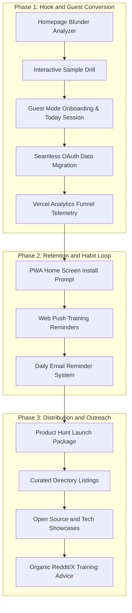

# BETA_PRIORITIZATION_PLAN.md: Open Beta Growth and Prioritization Plan

This document defines the strategic and technical execution plan to drive discovery, user onboarding, and retention during open beta.

## Context Pointers

- **Product Vision**: See [VISION.md](file:///home/joebos/programming/Mainline/planning/VISION.md) for brand philosophy, honesty principles, and system boundaries.
- **Growth Ethics**: See [GROWTH.md](file:///home/joebos/programming/Mainline/planning/GROWTH.md) for ethical user acquisition and cohort stages.
- **Technical Architecture**: See [BUILD.md](file:///home/joebos/programming/Mainline/planning/BUILD.md) for engine contracts and database schemas.
- **Learning Science**: See [METHODOLOGY.md](file:///home/joebos/programming/Mainline/planning/METHODOLOGY.md) for evidence grades and rationale schemas.

---

## 1. Executive Summary and Diagnosis

After the first 4 days of open beta:

- **Total Unique Visitors**: 3 to 5 unique visitors recorded.
- **Accounts Created**: 0 registered accounts.
- **Root Cause**: Mainline does not suffer from a retention defect. Mainline has a top-of-funnel discovery bottleneck. Generic promotional posts in saturated subreddits and unviewed Discord self-promotion channels produced almost zero qualified traffic.

### Strategic Shift

We shift focus from passive promotion to three core pillars:

1. **Interactive Utility Hook (Lead Magnet)**: Convert casual landing page visitors into active learners within 10 seconds.
2. **Zero-Friction Guest Mode**: Allow visitors to complete onboarding and Day 1 training without creating an account first.
3. **Multi-Channel Retention and Distribution**: Bring users back with PWA Web Push notifications and optional daily emails, while launching on Product Hunt and niche developer directories.

---

## 2. The 3-Phase Execution Roadmap

---

## 3. Phase 1: Lead Magnet and Guest Flow (Sprint 1)

### 3.1 Homepage Interactive Blunder Analyzer

- **Location**: Top section of [src/app/page.tsx](file:///home/joebos/programming/Mainline/src/app/page.tsx).
- **Functionality**:
  - Accept a Lichess or Chess.com username.
  - Fetch the user's last 10 to 20 games via public platform APIs.
  - Cache API responses in memory or database cache tables.
  - Compute the user's top tactical blindspot (such as undefended pieces or back-rank oversights).
  - Display a clean visual summary card showing their mistake pattern.
- **Interactive Move**:
  - Render 1 personal blunder fix puzzle directly on the page using client-side Stockfish WASM.
  - Let the visitor solve the puzzle interactively.
- **Call to Action**:
  - Display a prominent button: "Generate your full personalized training program (Free)".

### 3.2 Zero-Friction Guest Mode

- **Requirement**: A user can explore the full training program without signing in.
- **Flow**:
  - Clicking the CTA leads through constraint setup to [src/app/today](file:///home/joebos/programming/Mainline/src/app/today).
  - Store constraints, tactical baseline, and completed drill outcomes in browser `localStorage`.
  - Update route guards in [src/server/onboarding.ts](file:///home/joebos/programming/Mainline/src/server/onboarding.ts) to permit guest sessions.
- **Guest Banner**:
  - Show a non-intrusive banner on Today: "Training as Guest: Sign in with Lichess or Google to sync across devices".

### 3.3 Seamless OAuth Account Migration

- **Trigger**: The guest clicks "Sign in with Lichess" or "Sign in with Google".
- **Migration Procedure**:
  - Read the guest training state from `localStorage`.
  - Send the payload to a protected migration mutation after authentication.
  - Upsert user rows into PostgreSQL (`Assessment`, `ConstraintSet`, `ProgramSession`, `ActivityEvent`).
  - Clear the local guest payload after successful server synchronization.

### 3.4 Funnel Telemetry

- **Integration**: Use `@vercel/analytics/react` custom event tracking.
- **Tracked Steps**:
  1. `landing_view`: Visitor views homepage.
  2. `username_analyzed`: Visitor inputs chess username.
  3. `sample_drill_solved`: Visitor solves interactive homepage puzzle.
  4. `onboarding_completed`: Guest completes constraints.
  5. `day1_session_started`: Guest opens Today session.
  6. `day1_session_completed`: Guest finishes first daily session.
  7. `guest_account_migrated`: Guest signs in with OAuth.
  8. `day2_session_started`: User returns on Day 2.

---

## 4. Phase 2: Retention and Habit Engine (Sprint 2)

### 4.1 PWA Installation and Web Push Notifications

- **PWA Manifest**: Update [src/app/manifest.ts](file:///home/joebos/programming/Mainline/src/app/manifest.ts) with standalone display mode and icons.
- **Install Prompt**: Show an install banner after completing the first training session.
- **Web Push Notifications**:
  - Implement a service worker to support standard Web Push API.
  - Allow users to set a daily reminder time (such as 08:00 or 19:00 local time).

### 4.2 Optional Daily Email Reminders

- **Provider**: Integrate a transactional email service (such as Resend).
- **Email Content**:
  - Subject: "Your 15-minute training plan is ready for today"
  - Body: A clean, concise message with direct link to the Today session.
- **Privacy and Consent**:
  - Include an explicit opt-in toggle in onboarding and Settings.
  - Provide a single-click unsubscribe link in every email footer.

---

## 5. Phase 3: Distribution and Community Outreach (Sprint 3)

### 5.1 Product Hunt Launch Package

- **Product Name**: Mainline
- **Tagline**: Open-source, science-based chess training planner.
- **Media Assets**:
  - Clean screenshots showing the Homepage Blunder Analyzer, Evidence Rationales, and Interactive Drills.
- **Maker Statement**:
  - Emphasize AGPL-3.0 open-source code, zero ads, no paywalled training, and peer-reviewed learning science.

### 5.2 Curated Product Directories and Lists

- **Directories**: Submit to Product Hunt, BetaList, Microlaunch, Uneed.best, DevHunt, and AlternativeTo.
- **Curated GitHub Lists**: Open pull requests against `awesome-chess`, `awesome-nextjs`, and `awesome-open-source`.

### 5.3 Developer and Technical Showcases

- **Communities**: Reddit (`r/opensource`, `r/webdev`, `r/reactjs`), Dev.to, and Hacker News.
- **Content Angle**: "How we built a deterministic chess training planner with client-side Stockfish WASM and zero runtime AI".

### 5.4 Organic Value-Add Community Advice

- **Target Platforms**: Reddit (`r/chess`, `r/chessbeginners`) and X/Twitter.
- **Strategy**:
  - Monitor questions asking "How do I structure my daily chess training?" or "How to stop making blunders?".
  - Provide complete, evidence-based training advice based on [METHODOLOGY.md](file:///home/joebos/programming/Mainline/planning/METHODOLOGY.md).
  - Include a non-intrusive link to the free open-source planner.

---

## 6. Acceptance and Verification Checklist

### Sprint 1 Verification

- [ ] Entering a Lichess or Chess.com username fetches games and displays blunder metrics.
- [ ] The interactive blunder puzzle runs locally via Stockfish WASM without errors.
- [ ] A guest user can complete constraints and finish a Day 1 session.
- [ ] Signing in via OAuth imports all guest history into PostgreSQL without data loss.
- [ ] Vercel Analytics records custom funnel events properly.

### Sprint 2 Verification

- [ ] PWA install prompt triggers cleanly on desktop and mobile browsers.
- [ ] Web Push service worker registers and triggers local notifications.
- [ ] Daily reminder emails send at the scheduled time and support one-click unsubscribe.

### Sprint 3 Verification

- [ ] Product Hunt launch assets and listing copy are reviewed and scheduled.
- [ ] Directory submissions are confirmed and tracked in a launch spreadsheet.
